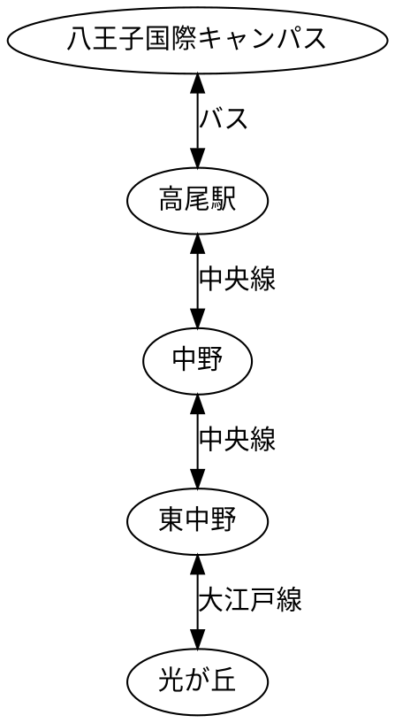

# 齊藤筑文の通学経路

[メンバー表に戻る](member.md#メンバー表)

```graphviz
digraph {
    edge [dir=both]

    八王子国際キャンパス -> 高尾駅 [label=バス]
    高尾駅 -> 中野 [label=中央線]
    中野 -> 東中野 [label=中央線]
    東中野 -> 光が丘 [label=大江戸線]
}
```
