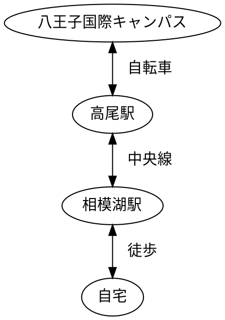

# 坂本英駿の通学経路

[メンバー表に戻る](member.md#メンバー表)

```graphviz
digraph {
    edge [dir=both]
        // 例
    八王子国際キャンパス -> 高尾駅 [label=　自転車]
    高尾駅 -> 相模湖駅 [label=　中央線]
    相模湖駅 -> 自宅 [label=　徒歩]
    
}
```
